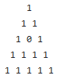

# TrianglePegPuzzle
Solver for the triangle peg puzzle / cracker barrel / golf tee puzzle, in Python



Just a learning experiment, no special features.

# Algorithm

This (very simple) algorithm utilizes brute-force by trying all moves/actions, made possible by the small state-space. Moves are attempted in a depth-first order, which keeps memory down and shortens computation time. It utilizes backtracking to retrace faulty moves by saving board states and corresponding attempted moves on a stack.

# Usage

To change the initial board (to move the starting hole), the easiest way is to change INIT_BOARD at the top.

In this line:
```python
#global_stats()
find_solution()
```

Choose one to comment out. find_solution() will output the first solution found for the board state. global_states() will print out statistics for each hole, including number of possible unique game and how many of them reach the best possible score

# Statistics

See [trongle.txt](trongle.txt). From the results, it seems that the middle holes touching each side give the best odds of winning, and that the center hole gives the worst odds

# Future Work

We could also support larger and more unique board sizes and additional rules. We could also calculate statistics on non-winning games to include situations where more than one peg is left at the terminal state.
